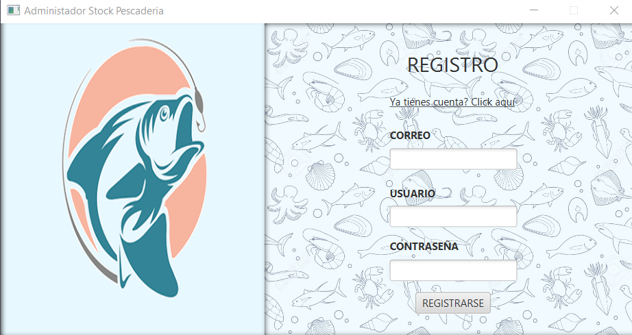
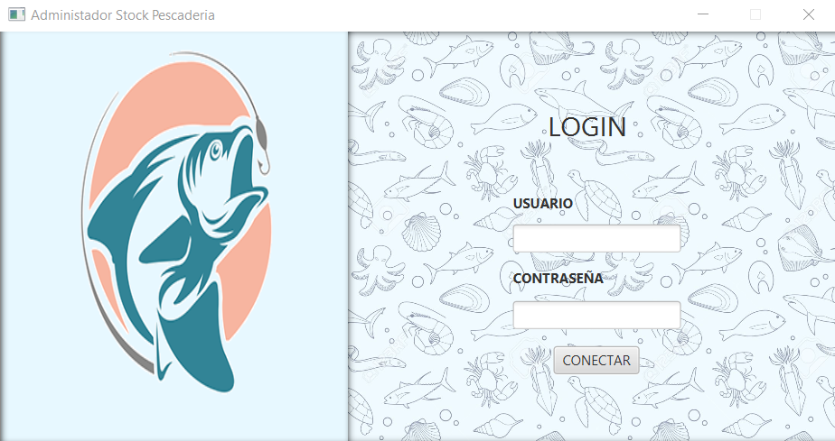
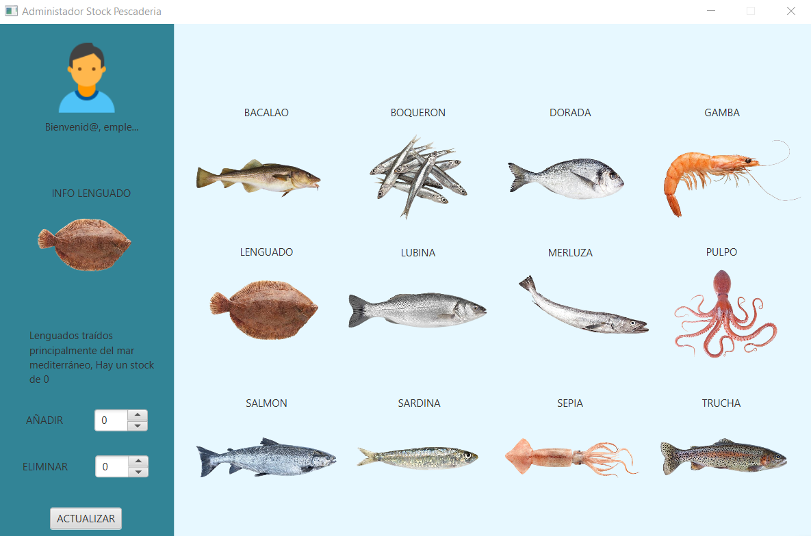

# AdministradorStockPescaderia

Aplicación para administar el stock de una pescadería








## Descripción

AdministradorStockPescaderia es una aplicación para la gestión de stocks de una pescaderia. También incluye funcionalidad básica de autenticación y gestión de sesiones de usuarios.

## Funcionalidades

- **Autenticación de usuarios**: Registro, inicio de sesión y gestión de sesiones.
- **Área principal para gestionar los stocks**: Añadir y eliminar las cantidades actuales.

## Tecnologías Utilizadas

- **Lenguaje de programación**: Java
- **Base de Datos**: MySql
- **Gestión de dependencias**: Maven
- **Framework de la GUI**: JavaFX
- **Diseños de la UI**: Scene Builder

## Versiones utilizadas

- Java 20
- Maven 3.8.5
- JavaFX 20

## Instalación

1. **Clonar el repositorio:**
    ```bash
    git clone https://github.com/pbl99/AdministradorStockPescaderia.git
    cd AdministradorStockPescaderia
    ```

2. **Compilar el proyecto:**

    ```bash
    mvn clean install
    ```

3. **Ejecutar la aplicación:**

    ```bash
    mvn javafx:run
    ```
### Base de Datos

Por defecto, la aplicación usa una base de datos MySql. Puedes cambiar la configuración de la base de datos en el archivo `StockDAO` y `UsuarioDAO` ubicado en `src/main/java/com/palmen/pescaderia/probandopescaderia/models`.

**Crear la Base de Datos**:
   - Abre tu cliente de MySQL (puede ser la línea de comandos, MySQL Workbench, y importa el archivo que esta en resources import.sql)
     
Ejemplo de configuración para MySQL:

```properties
    private static final String URL = "jdbc:mysql://localhost:3307/nombreDB";
    private static final String USUARIO = "usuarioDB";
    private static final String CLAVE = "contraseñaDB";
```

## Contribuir
Si deseas contribuir a este proyecto, por favor sigue estos pasos:

1. Fork el repositorio
2. Crea una nueva rama (git checkout -b feature/nueva-funcionalidad)
3. Realiza tus cambios y haz commit (git commit -am 'Añadir nueva funcionalidad')
4. Push a la rama (git push origin feature/nueva-funcionalidad)
5. Crea un Pull Request
   
## Licencia
Este proyecto está bajo la Licencia MIT. Consulta el archivo LICENSE para más detalles.
